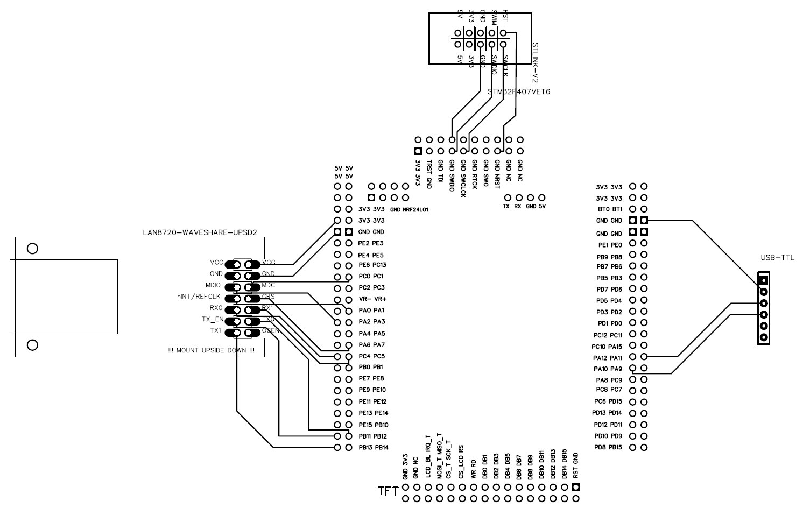

# STM32 Master

Welcome to the STM32 Feature Explorer project! The aim of this repo is to learn STM32 development by exploring the features of STM32F407VET6.

## Table of Contents
- [STM32 Master](#stm32-master)
  - [Table of Contents](#table-of-contents)
  - [Project Overview](#project-overview)
  - [Features](#features)
    - [Parts List](#parts-list)
    - [Connection Diagram:](#connection-diagram)
- [Using This Package](#using-this-package)
    - [Programming the STM32F407VET6](#programming-the-stm32f407vet6)
    - [Executing the Functional Tests](#executing-the-functional-tests)
    - [Contributing](#contributing)

## Project Overview
This project is designed to be a complete exploration of the STM32 microcontroller's capabilities. It includes a variety of modules and features that interact with the STM32, showcasing everything from basic GPIO control to advanced communication protocols and peripherals.

The project also includes a PC-side interface to interact with the STM32, demonstrating how to build robust communication channels between the microcontroller and a computer application. As well as functional tests of the firmware hardware combination.

## Features
 - UART Communication
   - Send commands from PC to STM32 and receive response
   - Command map to stm32 functions
 - TCP IP Communication
   - Use LAN8720 Module
   - Enable ping stm32
   - enable tcp ip data send receive from PC

### Parts List
   1. [STM32F407VET6 Development Board](https://stm32-base.org/boards/STM32F407VET6-STM32-F4VE-V2.0.html#JTAG-header)
   2. [STLINK V2](https://www.adafruit.com/product/2548)
   3. [LAN8720 ETH Board](https://www.waveshare.com/lan8720-eth-board.htm)
   4. [SH-U09C5 USB to TTL] (https://www.deshide.com/product-details.html?pid=303205&_t=1661493660)

### Connection Diagram:

# Using This Package
  
  ### Programming the STM32F407VET6
  1. Clone the Repo onto your system
  2. Open the stm32 folder using STM32CubeIDE
     1. In STM32CubeIDE:
        1. File -> "Open Projects From File System..."
        2. Directory -> choose the stm32 directory of the cloned repo
        3. Open the Project
  3. build and Run the Project:
     1. Project -> Generate Code
     2. Project -> Build All
     3. Run (Green play button)
   

### Executing the Functional Tests

1. From Top Directory:
   1. Add the pip requirements
      1. `pip install -r python/requirements.txt`
   2. Run the tests:
      1. `python -m pytest`

### Contributing

1. Install the pre-commit hook:
   1. `pre-commit install`
   2. All Commits will need to be black formatted + pass all functional tests
      1. When commit hooks fail:
         1. For Black Lint
            1. `git add --all` to stage the updates by black
            2. `git commit` to rerun pre-commit hook
         2. For Functional Tests
            1. The STM32 functional Tests must pass!

